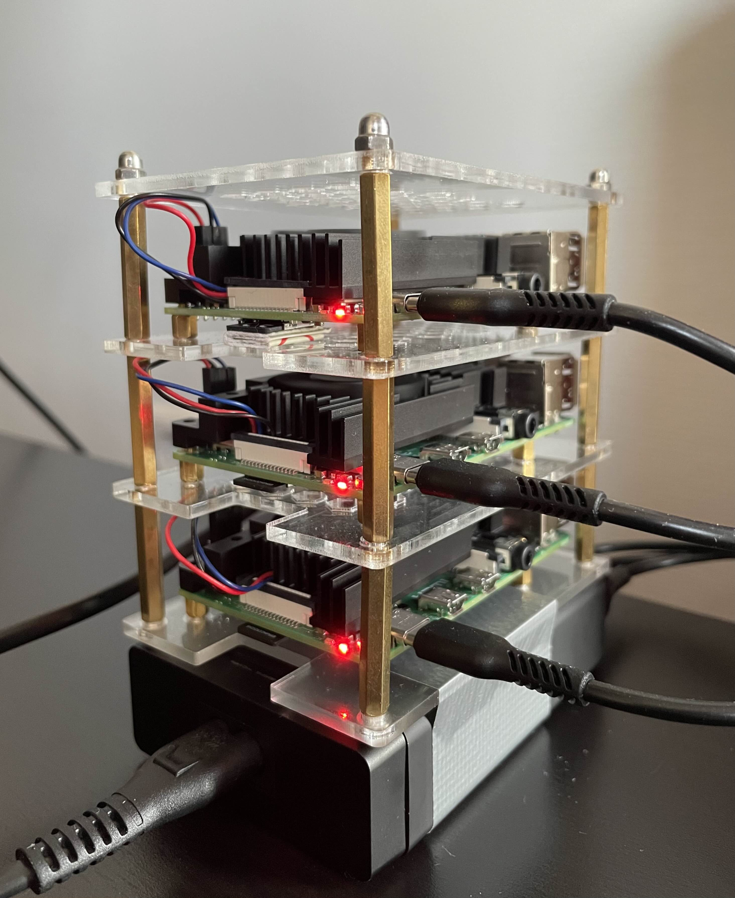

# malyna-cluster-logbook

This is a logbook of my home lab cluster setup.



## hardware

- 3x Raspberry Pi 4B (2x 4GB RAM, 1x 8GB RAM)
- 3x 32GB microSD card
- 1x usb hub anker with 6 usb ports

## software
- Raspberry Pi OS Lite (64-bit) a port of Debian Trixie with no desktop environment

## configuration

- node1:
  - hostname: malyna
  - role: master
- node2:
  - hostname: kalyna
  - role: worker
- node3:
  - hostname: lohyna
  - role: worker

## logbook records

### 2026-03-20

- [installed k3s on the cluster](kubernetes.md#installing-k3s-on-raspberry-pi-cluster)

#### grafana alloy is failing to send metrics with HTTP 401 after reboot of all nodes

today after reboot of all nodes I spotted that grafana alloy is failing to send metrics with HTTP 401

```
Mar 20 16:21:12 malyna alloy[1176]: ts=2026-03-20T15:21:12.568780257Z level=error msg="final error sending batch, no retries left, dropping data" component_path=/ component_id=loki.write.grafana_cloud_loki component=endpoint host=logs-prod-012.grafana.net status=401 tenant="" error="server returned HTTP status 401 Unauthorized (401): {\"status\":\"error\",\"error\":\"authentication error: invalid token\"}"
```

after two hours of doing nothing I realizzed it's fixed itself

```
Mar 20 17:41:49 malyna alloy[1176]: ts=2026-03-20T16:41:49.346904273Z level=info msg="reporting Alloy stats" date=2026-03-20T17:41:49.346+01:00
Mar 20 17:41:49 malyna alloy[1176]: ts=2026-03-20T16:41:49.551465169Z level=info msg="usage report sent with success"
```

### 2026-03-16

- installed [Grafana Alloy](https://grafana.com/docs/alloy/latest/set-up/install/linux/) on each node to monitor system metrics and visualize them in Grafana dashboards
  - grafana alloy is running as a **systemd service** on each node, collecting metrics and sending them to the Grafana
  - grafana alloy hostname and other default configuration added in /etc/alloy/config.alloy
- re-installed OS from scratch for `kalyna` because it was unreachable, no ip assigned by DHCP on router
- installed [tailscale](https://tailscale.com/docs/install/linux#mainstream-distributions) client on each node to create a secure mesh network between them, allowing me to access them remotely without worrying about dynamic IP addresses assigned by the router DHCP
  - tailscale is running as a **systemd service** `tailscaled` on each node, automatically connecting to the mesh network on boot
  
### 2026-03-08

- ssh key-based authentication configured on all nodes
- ssh password authentication disabled on all nodes
- catch-22: do not hardcode dynamic IP addresses in the SSH configuration
  - details: locked myself out of all nodes by hardcoding dynamic IP addresses in the ListenAddress in SSH configuration, when restarted the nodes got different IP addresses assigned by the router DHCP, which caused me to lose SSH access to all nodes. I got back in by re-installing the OS on SD cards and re-configuring SSH access